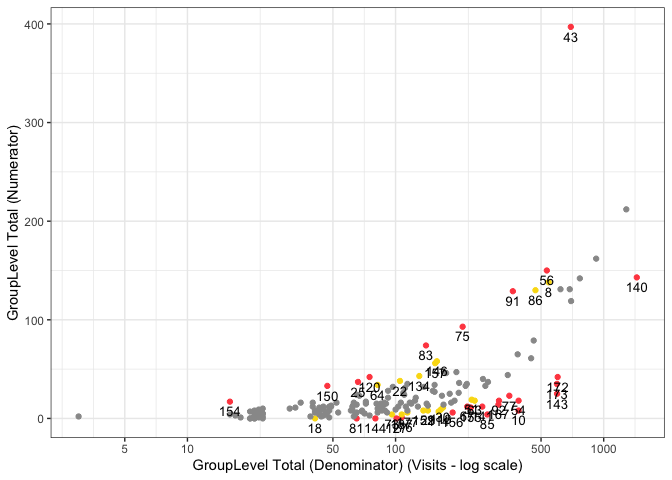

<!-- README.md is generated from README.Rmd. Please edit that file -->

# gsm.simaerep

<!-- badges: start -->

[](https://github.com/IMPALA-Consortium/gsm.simaerep/actions/workflows/R-CMD-check.yaml)
<!-- badges: end -->

This is a [{simaerep}](https://github.com/openpharma/simaerep/)
extension for the [{gsm}](https://github.com/Gilead-BioStats/gsm)
package.

The package provides:

`gsm`-style functions as detailed
[here](https://gilead-biostats.github.io/gsm/articles/DataModel.html):

- `Input_CumCount()` patient-level cumulative count from source data
- `Analyze_Simaerep()` will execute `simaerep`
- `Flag_Simaerep()` alias of `gsm::Flag`

required module configuration files:

- `inst/workflow/1_mappings`
- `inst/workflow/2_metrics`

KRI:

- AE Over/Under- Reporting Probability
- PD Over/Under- Reporting Probability
- AE Z-Score
- PD Z-Score

## Why use {simaerep}?

{simaerep} uses a metric ratio to detect over/under-reporting of
subject-related clinical events such as AEs. It accounts for sites
having different denominator counts similarly to z-scores derived from
normal approximations in funnel plots which is the {gsm} standard. On
top of that **{simaerep} considers changing event (numerator)
probabilities over time**. This advantage is particularly important when
monitoring ongoing studies and sites start enrolling patients at
different times. Typically event rates are higher at the beginning of a
study and decrease over time. {simaerep} can detect this pattern and
adjust for it and we **avoid comparing sites with a few patients that
are all in follow-up to sites with many patients that at the beginning
of their treatment cycle**. In a simulation experiment we could show
that {simaerep} outperforms z-scores when event rates are not constant
over-time but comparable when event rates are constant over time [see
documentation](https://openpharma.github.io/simaerep/articles/funnel_perf.html).
This [example
report](https://impala-consortium.github.io/gsm.simaerep/report_kri_site.html)
plots {simaerep} results onto the the familiar {gsm} scatter plots next
to their z-score counter parts. We can appreciate the similarity of the
results the most noticeable difference is {simaerep} assigning greater
scores to allegedly under-reporting sites. As the normal approximation
produces negative lower boundaries for lower denominator counts that are
set to zero, high z-scores associated with high probabilities are
unobtainable in these regions. The calibrated outlier probabilities
obtained from z-scores are not symmetric, a site with a z-score of 2
does not have the same outlier probability as a site with a z-score of
-2. {simaerep} is **non-parametric** and provides realistic
probabilities for all ranges of denominator counts for upper and lower
outliers.

Resources:

- [simaerep statistical
  performance](https://openpharma.github.io/simaerep/articles/performance.html)
- Bootstrap Simulation for Outlier Detection in Operational Site Metrics
  Using Patient Reassignment [PHUSE
  Paper](https://phuse.s3.eu-central-1.amazonaws.com/Archive/2024/Connect/EU/Strasbourg/PAP_AR04.pdf),
  [PHUSE
  Presentation](https://phuse.s3.eu-central-1.amazonaws.com/Archive/2024/Connect/EU/Strasbourg/PRE_AR04.pdf)
- [An Open-Source R Package for Detection of Adverse Events
  Under-Reporting in Clinical Trials: Implementation and Validation by
  the IMPALA (Inter coMPany quALity Analytics)
  Consortium](https://link.springer.com/article/10.1007/s43441-024-00631-8)

## Installation

You can install the development version of gsm.simaerep from
[GitHub](https://github.com/IMPALA-Consortium/gsm.simaerep/) with:

``` r
# install.packages("pak")
pak::pak("Gilead-BioStats/clindata")
pak::pak("Gilead-BioStats/gsm@v2.2.1")
pak::pak("IMPALA-Consortium/gsm.simaerep")
```

## Documentation

For a more detailed description see the [gsm.simaerep
Cookbook](https://impala-consortium.github.io/gsm.simaerep/articles/Cookbook.html)

## Example

``` r
library(gsm.simaerep)

dfInput <- Input_CumCount(
   dfSubjects = clindata::rawplus_dm,
   dfNumerator = clindata::rawplus_ae,
   dfDenominator = clindata::rawplus_visdt %>% dplyr::mutate(visit_dt = lubridate::ymd(visit_dt)),
   strSubjectCol = "subjid",
   strGroupCol = "siteid",
   strGroupLevel = "Site",
   strNumeratorDateCol = "aest_dt",
   strDenominatorDateCol  = "visit_dt"
 )

dfAnalyzed <- Analyze_Simaerep(dfInput)

dfFlagged <- Flag_Simaerep(dfAnalyzed, vThreshold = c(-0.99, -0.95, 0.95, 0.99))
#> ℹ Sorted dfFlagged using custom Flag order: 2.Sorted dfFlagged using custom Flag order: -2.Sorted dfFlagged using custom Flag order: 1.Sorted dfFlagged using custom Flag order: -1.Sorted dfFlagged using custom Flag order: 0.

gsm::Visualize_Scatter(
  dfFlagged,
  dfBounds = NULL,
  strGroupLabel = "GroupLevel",
  strUnit = "Visits"
)
```



## Sample Report

- [Sample
  Report](https://impala-consortium.github.io/gsm.simaerep/report_kri_site.html)

## Quality Control

Since {gsm} is designed for use in a
[GCP](https://en.wikipedia.org/wiki/Good_clinical_practice) framework,
we have conducted extensive quality control as part of our development
process. In particular, we do the following during early development:

- **Unit Tests** - Unit tests are written for all core functions, 100%
  coverage required.
- **Workflow Tests** - Additional unit tests confirm that core workflows
  behave as expected.
- **Function Documentation** - Detailed documentation for each exported
  function with examples is maintained with Roxygen.
- **Package Checks** - Standard package checks are run using GitHub
  Actions and must be passing before PRs are merged.
- **Continuous Integration** - Continuous integration is provided via
  GitHub Actions.
- **Code Formatting** - Code is formatted with {styler} before each
  release.
- **Contributor Guidelines** - Detailed contributor guidelines including
  step-by-step processes for code development and releases are provided
  as a vignette.
- **Code Demonstration** -
  [Cookbook](https://impala-consortium.github.io/gsm.simaerep/articles/Cookbook.html)
  Vignette provides demos and explanations for code usage.

### Parking

As development progresses, we will also conduct the following quality
control steps:

- **Qualification Workflow** - All assessments have been Qualified as
  described in the Qualification Workflow Vignette. A Qualification
  Report Vignette is generated and attached to each release.
- **Code Review** - Code review is conducted using GitHub Pull Requests
  (PRs), and a log of all PRs is included in the Qualification Report
  Vignette.
- **Data Specifications** - Machine-readable data specifications are
  maintained for all KRIs. Specifications are automatically added to
  relevant function documentation.
- **Regression Testing** - Extensive QC and testing is done before each
  release.
