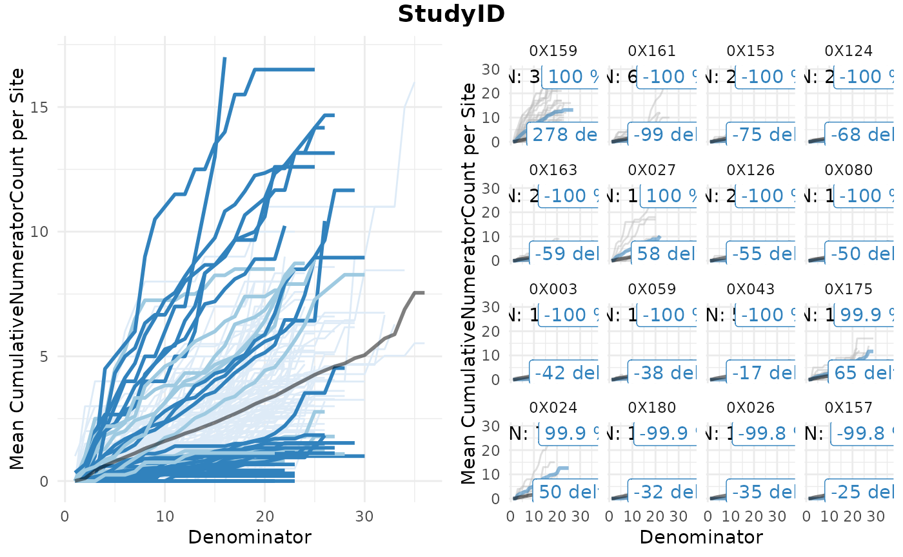
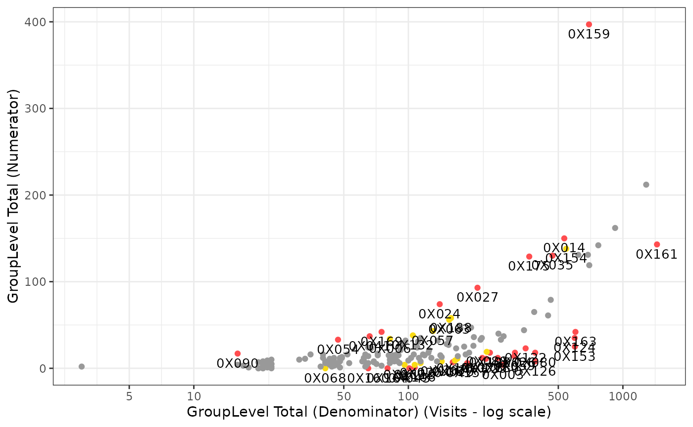

# Cookbook

## Introduction

This vignette contains sample code showing how to use the
[gsm](https://github.com/Gilead-BioStats/gsm) extension
[gsm.simaerep](https://github.com/IMPALA-Consortium/gsm.simaerep) using
sample data from
[clindata](https://github.com/Gilead-BioStats/clindata).

In order to familiarize yourself with the `gsm` package, please refer to
the [gsm
cookbook](https://gilead-biostats.github.io/gsm/articles/Cookbook.html).

### Installation

``` r
install.packages("pak")
pak::pak("Gilead-BioStats/clindata")
pak::pak("Gilead-BioStats/gsm.core")
pak::pak("Gilead-BioStats/gsm.mapping")
pak::pak("Gilead-BioStats/gsm.kri")
pak::pak("Gilead-BioStats/gsm.reporting")
pak::pak("IMPALA-Consortium/gsm.simaerep")
```

### Load

``` r
suppressPackageStartupMessages(library(dplyr))
library(gsm.core)
library(gsm.mapping)
library(gsm.kri)
library(gsm.reporting)
library(gsm.simaerep)
#> 
#> Attaching package: 'gsm.simaerep'
#> The following object is masked from 'package:gsm.kri':
#> 
#>     MakeCharts
```

## {gsm.simaerep} Functions

`simaerep` expects the cumulative count of numerator events per
denominator event per subject as input.

In this example we we are calculating the cumulative AE count per visit
per patient per site.

``` r
dfInput <- Input_CumCount(
  dfSubjects = clindata::rawplus_dm,
  dfNumerator = clindata::rawplus_ae,
  dfDenominator = clindata::rawplus_visdt %>% dplyr::mutate(visit_dt = lubridate::ymd(visit_dt)),
  strSubjectCol = "subjid",
  strGroupCol = "invid",
  strGroupLevel = "Site",
  strNumeratorDateCol = "aest_dt",
  strDenominatorDateCol = "visit_dt"
)

dfInput %>%
  dplyr::filter(max(Numerator) > 1, .by = "SubjectID") %>%
  head(25) %>%
  knitr::kable()
```

| SubjectID | GroupID | GroupLevel | Numerator | Denominator |
|:----------|:--------|:-----------|----------:|------------:|
| 0358      | 0X001   | Site       |         0 |           1 |
| 0358      | 0X001   | Site       |         0 |           2 |
| 0358      | 0X001   | Site       |         0 |           3 |
| 0358      | 0X001   | Site       |         0 |           4 |
| 0358      | 0X001   | Site       |         0 |           5 |
| 0358      | 0X001   | Site       |         1 |           6 |
| 0358      | 0X001   | Site       |         1 |           7 |
| 0358      | 0X001   | Site       |         1 |           8 |
| 0358      | 0X001   | Site       |         1 |           9 |
| 0358      | 0X001   | Site       |         1 |          10 |
| 0358      | 0X001   | Site       |         2 |          11 |
| 0358      | 0X001   | Site       |         2 |          12 |
| 0358      | 0X001   | Site       |         2 |          13 |
| 0358      | 0X001   | Site       |         2 |          14 |
| 0358      | 0X001   | Site       |         5 |          15 |
| 0358      | 0X001   | Site       |         5 |          16 |
| 0358      | 0X001   | Site       |         6 |          17 |
| 0358      | 0X001   | Site       |         6 |          18 |
| 0358      | 0X001   | Site       |         7 |          19 |
| 0358      | 0X001   | Site       |         7 |          20 |
| 0358      | 0X001   | Site       |         7 |          21 |
| 0664      | 0X001   | Site       |         0 |           1 |
| 0664      | 0X001   | Site       |         0 |           2 |
| 0664      | 0X001   | Site       |         0 |           3 |
| 0664      | 0X001   | Site       |         0 |           4 |

Now we can analyze the data using
[`Analyze_Simaerep()`](https://impala-consortium.github.io/gsm.simaerep/reference/Analyze_Simaerep.md)
and add flags with
[`Flag_Simaerep()`](https://impala-consortium.github.io/gsm.simaerep/reference/Flag_Simaerep.md)
which adds a Score between -1 and 1. Positive values indicate the
over-reporting probability and negative values indicate the
under-reporting probability.

`ExpectedNumerator` is the number of expected AEs for a site with the
same patient configuration. `ScoreMult` is Score with applied
multiplicity correction.

``` r
dfAnalyzed <- Analyze_Simaerep(dfInput)
dfFlagged <- Flag_Simaerep(dfAnalyzed, vThreshold = c(-0.99, -0.95, 0.95, 0.99))
#> ℹ Sorted dfFlagged using custom Flag order: 2.Sorted dfFlagged using custom Flag order: -2.Sorted dfFlagged using custom Flag order: 1.Sorted dfFlagged using custom Flag order: -1.Sorted dfFlagged using custom Flag order: 0.


dfFlagged %>%
  arrange(Score) %>%
  head(25) %>%
  knitr::kable()
```

| GroupID | GroupLevel | Numerator | Denominator |    Metric |  Score |  ScoreMult | ExpectedNumerator | Flag |
|:--------|:-----------|----------:|------------:|----------:|-------:|-----------:|------------------:|-----:|
| 0X003   | Site       |         4 |         276 | 0.0144928 | -1.000 | -1.0000000 |           -41.979 |   -2 |
| 0X043   | Site       |         0 |         101 | 0.0000000 | -1.000 | -1.0000000 |           -16.516 |   -2 |
| 0X059   | Site       |        14 |         312 | 0.0448718 | -1.000 | -1.0000000 |           -38.485 |   -2 |
| 0X080   | Site       |        18 |         390 | 0.0461538 | -1.000 | -1.0000000 |           -49.982 |   -2 |
| 0X124   | Site       |        35 |         596 | 0.0587248 | -1.000 | -1.0000000 |           -67.513 |   -2 |
| 0X126   | Site       |         8 |         390 | 0.0205128 | -1.000 | -1.0000000 |           -55.256 |   -2 |
| 0X153   | Site       |        25 |         597 | 0.0418760 | -1.000 | -1.0000000 |           -74.767 |   -2 |
| 0X161   | Site       |       143 |        1442 | 0.0991678 | -1.000 | -1.0000000 |           -98.937 |   -2 |
| 0X163   | Site       |        42 |         601 | 0.0698835 | -1.000 | -1.0000000 |           -59.112 |   -2 |
| 0X180   | Site       |        12 |         261 | 0.0459770 | -0.999 | -0.9824000 |           -32.029 |   -2 |
| 0X026   | Site       |        18 |         314 | 0.0573248 | -0.998 | -0.9729231 |           -34.709 |   -2 |
| 0X106   | Site       |         1 |         107 | 0.0093458 | -0.998 | -0.9729231 |           -17.200 |   -2 |
| 0X157   | Site       |         6 |         188 | 0.0319149 | -0.998 | -0.9729231 |           -24.729 |   -2 |
| 0X125   | Site       |        11 |         230 | 0.0478261 | -0.996 | -0.9497143 |           -29.653 |   -2 |
| 0X016   | Site       |         7 |         161 | 0.0434783 | -0.995 | -0.9450000 |           -22.047 |   -2 |
| 0X122   | Site       |        23 |         352 | 0.0653409 | -0.995 | -0.9450000 |           -36.143 |   -2 |
| 0X160   | Site       |         0 |          65 | 0.0000000 | -0.993 | -0.9275294 |           -10.529 |   -2 |
| 0X178   | Site       |        12 |         221 | 0.0542986 | -0.992 | -0.9217778 |           -23.114 |   -2 |
| 0X129   | Site       |        18 |         240 | 0.0750000 | -0.991 | -0.9208000 |           -25.081 |   -2 |
| 0X164   | Site       |         0 |          80 | 0.0000000 | -0.991 | -0.9208000 |           -13.117 |   -2 |
| X187X   | Site       |         9 |         165 | 0.0545455 | -0.972 | -0.7680000 |           -17.206 |   -1 |
| 0X119   | Site       |         4 |         107 | 0.0373832 | -0.971 | -0.7680000 |           -13.469 |   -1 |
| 0X088   | Site       |        19 |         232 | 0.0818966 | -0.967 | -0.7536000 |           -20.798 |   -1 |
| 0X069   | Site       |         4 |          96 | 0.0416667 | -0.966 | -0.7536000 |           -12.778 |   -1 |
| 0X100   | Site       |        11 |         169 | 0.0650888 | -0.965 | -0.7536000 |           -19.505 |   -1 |

``` r
dfFlagged %>%
  arrange(Score) %>%
  tail(5) %>%
  knitr::kable()
```

| GroupID | GroupLevel | Numerator | Denominator |    Metric | Score | ScoreMult | ExpectedNumerator | Flag |
|:--------|:-----------|----------:|------------:|----------:|------:|----------:|------------------:|-----:|
| 0X054   | Site       |        33 |          47 | 0.7021277 | 0.996 |    0.8592 |            24.051 |    2 |
| 0X024   | Site       |        74 |         140 | 0.5285714 | 0.999 |    0.9560 |            50.403 |    2 |
| 0X175   | Site       |       129 |         366 | 0.3524590 | 0.999 |    0.9560 |            65.193 |    2 |
| 0X027   | Site       |        93 |         210 | 0.4428571 | 1.000 |    1.0000 |            57.975 |    2 |
| 0X159   | Site       |       397 |         695 | 0.5712230 | 1.000 |    1.0000 |           278.328 |    2 |

We can visualize the results as a ggplot or a htmlwidget

``` r
gsm.simaerep::Visualize_Simaerep(
  dfInput,
  dfFlagged
)
```



``` r
gsm.simaerep::Widget_Simaerep(
  dfInput,
  dfFlagged
)
```

``` r
gsm.simaerep::Widget_BarChartSimaerep(
  dfFlagged,
  resultTooltipKeys = c(
    "ExpectedNumerator",
    "Score",
    "Metric",
    "Numerator",
    "Denominator"
  )
)
```

These results are compatible with the `gsm` package for visualization.

*\`simaerep* scores represent are related to the metric ratio do not use
a metric based threshold for flagging. Therefore we do not need to
calculate boundaries to pass to the plotting function.

``` r
gsm.kri::Visualize_Scatter(
  dfFlagged,
  dfBounds = NULL,
  strGroupLabel = "GroupLevel",
  strUnit = "Visits"
)
```



``` r
Widget_ScatterPlot(
  dfFlagged,
  dfBounds = NULL,
  bDebug = FALSE,
  resultTooltipKeys = c(
    "ExpectedNumerator",
    "Score",
    "Metric",
    "Numerator",
    "Denominator"
  )
)
```

To compare we can also use the Score with applied multiplicity
correction. For this we need to lower the threshold to be less sensitive
to get a similar readout. Here we can see that overall the multiplicity
correction dampens the score values and reduces the number of flagged
sites. Simulation studies with {simaerep} have shown that multiplicity
correction decreases detection rates. Nevertheless when monitoring a
limited number of studies with many sites a sharper signal might be
preferred.

``` r
dfFlagged_Mult <- Flag_Simaerep(
  dfAnalyzed %>%
    mutate(Score = ScoreMult),
  vThreshold = c(-0.95, -0.75, 0.75, 0.95)
)
#> ℹ Sorted dfFlagged using custom Flag order: 2.Sorted dfFlagged using custom Flag order: -2.Sorted dfFlagged using custom Flag order: 1.Sorted dfFlagged using custom Flag order: -1.Sorted dfFlagged using custom Flag order: 0.

Widget_BarChart(
  dfFlagged_Mult
)
```

## Report Building

We can create a workflow to create the `gsm` KRI report.

### Mapping

``` r
lRaw <- list(
  Raw_SUBJ = clindata::rawplus_dm,
  Raw_AE = clindata::rawplus_ae,
  Raw_VISIT = clindata::rawplus_visdt,
  Raw_PD = clindata::ctms_protdev,
  Raw_ENROLL = clindata::rawplus_enroll,
  Raw_SITE = clindata::ctms_site,
  Raw_STUDY = clindata::ctms_study,
  Raw_SDRGCOMP = clindata::rawplus_sdrgcomp
)


mapping_wf <- gsm.core::MakeWorkflowList(
  strNames = NULL,
  strPath = system.file("workflow/1_mappings", package = "gsm.simaerep"),
  strPackage = NULL
)

lIngest <- gsm.mapping::Ingest(lRaw, gsm.mapping::CombineSpecs(mapping_wf))
#> Warning: Field `visit_dt`: 19 unparsable Date(s) set to NA

lMapped <- gsm.core::RunWorkflows(lWorkflows = mapping_wf, lData = lIngest)
```

### Metrics

``` r
metrics_wf <- gsm.core::MakeWorkflowList(
  strNames = NULL,
  strPath = system.file("workflow/2_metrics", package = "gsm.simaerep"),
  strPackage = NULL
)

lAnalyzed <- gsm.core::RunWorkflows(lWorkflows = metrics_wf, lData = lMapped)
```

### Report Generation - Workflow

``` r
reporting_wf <- gsm.core::MakeWorkflowList(
  strNames = NULL,
  strPath = system.file("workflow/3_reporting", package = "gsm.simaerep"),
  strPackage = NULL
)


lReport <- gsm.core::RunWorkflows(
  lWorkflows = reporting_wf,
  lData = c(
    lMapped,
    list(
      lAnalyzed = lAnalyzed,
      lWorkflows = metrics_wf
    )
  )
)

module_wf_gsm <- gsm.core::MakeWorkflowList(
  strNames = NULL,
  strPath = system.file("workflow/4_modules", package = "gsm.simaerep"),
  strPackage = NULL
)

# we cannot set a dynamic link to the report path in the yaml files
report_path <- system.file("report", "Report_KRI.Rmd", package = "gsm.simaerep")
n_steps <- length(module_wf_gsm$report_kri_site$steps)
module_wf_gsm$report_kri_site$steps[[n_steps]]$params$strInputPath <- report_path

lModule <- gsm.core::RunWorkflows(module_wf_gsm, lReport)
#> /opt/hostedtoolcache/pandoc/3.1.11/x64/pandoc +RTS -K512m -RTS /tmp/RtmpkeAcfx/Report_KRI.knit.md --to html4 --from markdown+autolink_bare_uris+tex_math_single_backslash --output /home/runner/work/gsm.simaerep/gsm.simaerep/vignettes/kri_report_AAAA0000000_Site_20251212.html --lua-filter /home/runner/work/_temp/Library/rmarkdown/rmarkdown/lua/pagebreak.lua --lua-filter /home/runner/work/_temp/Library/rmarkdown/rmarkdown/lua/latex-div.lua --embed-resources --standalone --variable bs3=TRUE --section-divs --table-of-contents --toc-depth 3 --variable toc_float=1 --variable toc_selectors=h1,h2,h3 --variable toc_smooth_scroll=1 --variable toc_print=1 --template /home/runner/work/_temp/Library/rmarkdown/rmd/h/default.html --no-highlight --variable highlightjs=1 --variable theme=bootstrap --css styles.css --include-in-header /tmp/RtmpkeAcfx/rmarkdown-str1db14e39bd25.html
```

### Report Generation - Script

``` r
dfMetrics <- gsm.reporting::MakeMetric(lWorkflows = metrics_wf)

lAnalyzed <- gsm.core::RunWorkflows(lWorkflows = metrics_wf, lData = lMapped)


dfResults <- gsm.reporting::BindResults(
  lAnalysis = lAnalyzed,
  strName = "Analysis_Flagged",
  dSnapshotDate = Sys.Date(),
  strStudyID = "ABC-123"
)

dfInput <- gsm.reporting::BindResults(
  lAnalysis = lAnalyzed,
  strName = "Analysis_Input",
  dSnapshotDate = Sys.Date(),
  strStudyID = "ABC-123"
)

dfGroups <- dplyr::bind_rows(
  lMapped$Mapped_STUDY,
  lMapped$Mapped_SITE,
  lMapped$Country
)

dfBounds <- gsm.reporting::MakeBounds(
  dfResults = dfResults,
  dfMetrics = dfMetrics
)

lCharts_Rate <- gsm.simaerep::MakeCharts(
  dfResults = dfResults %>%
    filter(GroupLevel == "Site"),
  dfMetrics = dfMetrics %>%
    filter(GroupLevel == "Site", AnalysisType == c("rate", "binary")),
  dfGroups = dfGroups,
  dfBounds = dfBounds,
  bDebug = FALSE,
  strVisualizeFun = "gsm.kri::Visualize_Metric"
)

# we use a different tooltip for the simaerep charts
lCharts_Identity <- gsm.simaerep::MakeCharts(
  dfInput = dfInput %>%
    filter(GroupLevel == "Site"),
  dfResults = dfResults %>%
    filter(GroupLevel == "Site"),
  dfMetrics = dfMetrics %>%
    filter(GroupLevel == "Site", AnalysisType == "identity"),
  dfGroups = dfGroups,
  dfBounds = NULL,
  bDebug = FALSE,
  resultTooltipKeys = c(
    "ExpectedNumerator",
    "Score",
    "Metric",
    "Numerator",
    "Denominator"
  )
)

lCharts <- c(
  lCharts_Identity,
  lCharts_Rate
)

gsm.kri::Report_KRI(
  lCharts = lCharts,
  dfResults = dfResults,
  dfGroups = dfGroups,
  dfMetrics = dfMetrics,
  strOutputFile = "report_kri_site.html",
  strInputPath = system.file("report", "Report_KRI.Rmd", package = "gsm.simaerep")
)
#> /opt/hostedtoolcache/pandoc/3.1.11/x64/pandoc +RTS -K512m -RTS /tmp/RtmpkeAcfx/Report_KRI.knit.md --to html4 --from markdown+autolink_bare_uris+tex_math_single_backslash --output /home/runner/work/gsm.simaerep/gsm.simaerep/vignettes/report_kri_site.html --lua-filter /home/runner/work/_temp/Library/rmarkdown/rmarkdown/lua/pagebreak.lua --lua-filter /home/runner/work/_temp/Library/rmarkdown/rmarkdown/lua/latex-div.lua --embed-resources --standalone --variable bs3=TRUE --section-divs --table-of-contents --toc-depth 3 --variable toc_float=1 --variable toc_selectors=h1,h2,h3 --variable toc_smooth_scroll=1 --variable toc_print=1 --template /home/runner/work/_temp/Library/rmarkdown/rmd/h/default.html --no-highlight --variable highlightjs=1 --variable theme=bootstrap --css styles.css --include-in-header /tmp/RtmpkeAcfx/rmarkdown-str1db174f94f02.html
```
